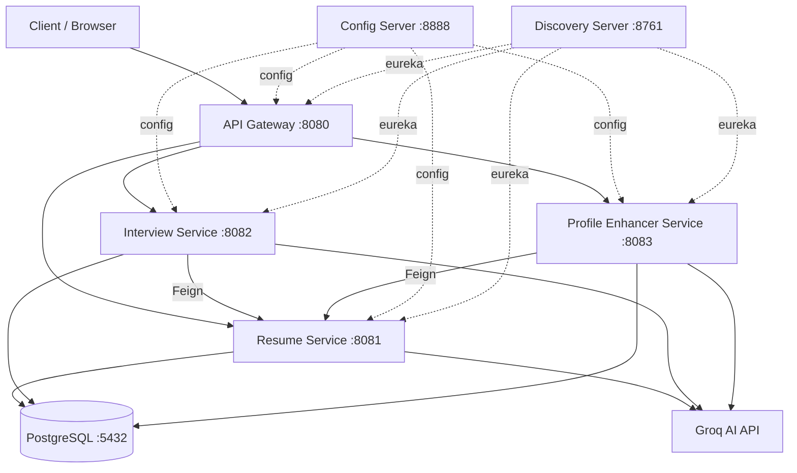

# Resume AI Platform

AI-powered resume parsing, interview question generation, and profile enhancement platform built with Spring Boot microservices, Spring Cloud, Spring AI, and PostgreSQL.

## Architecture



## Services

| Service | Port | Description |
|---------|------|-------------|
| Config Server | 8888 | Centralized configuration (Spring Cloud Config, native profile) |
| Discovery Server | 8761 | Service registry (Netflix Eureka) |
| API Gateway | 8080 | Request routing and load balancing (Spring Cloud Gateway) |
| Resume Service | 8081 | Resume upload/parsing (Apache Tika + AI) and job description management |
| Interview Service | 8082 | AI-powered interview question generation |
| Profile Enhancer Service | 8083 | Resume-JD gap analysis, keyword optimization, rewriting |
| PostgreSQL | 5432 | Shared relational database |

## Prerequisites

- **Java 17+**
- **Maven 3.8+** (or use the included `./mvnw` wrapper)
- **Docker & Docker Compose** (for containerized deployment)
- **Groq API Key** — get one free at [https://console.groq.com](https://console.groq.com)

## Setup

### 1. Set the Groq API Key

```bash
export GROQ_API_KEY=your_groq_api_key_here
```

### 2. Build All Modules

```bash
./mvnw clean install -DskipTests
```

### 3. Run with Docker Compose

```bash
docker compose up --build
```

This starts all services in order with health-check-based dependency management:
1. PostgreSQL (with healthcheck)
2. Config Server (waits for healthy)
3. Discovery Server (waits for Config Server)
4. API Gateway, Resume Service, Interview Service, Profile Enhancer Service

### 4. Run Locally (without Docker)

Start services in order:
```bash
# Terminal 1: Config Server
cd resume-ai-config-server && ../mvnw spring-boot:run

# Terminal 2: Discovery Server (wait ~15s for config server)
cd resume-ai-discovery-server && ../mvnw spring-boot:run

# Terminal 3: Resume Service (requires PostgreSQL running locally)
cd resume-ai-resume-service && GROQ_API_KEY=$GROQ_API_KEY ../mvnw spring-boot:run

# Terminal 4: Interview Service
cd resume-ai-interview-service && GROQ_API_KEY=$GROQ_API_KEY ../mvnw spring-boot:run

# Terminal 5: Profile Enhancer Service
cd resume-ai-profile-enhancer-service && GROQ_API_KEY=$GROQ_API_KEY ../mvnw spring-boot:run

# Terminal 6: API Gateway
cd resume-ai-api-gateway && ../mvnw spring-boot:run
```

## API Reference

### Resume Service

| Method | Endpoint | Description |
|--------|----------|-------------|
| POST | `/api/resumes/upload` | Upload and parse a resume (multipart file) |
| GET | `/api/resumes/{id}` | Get parsed resume by ID |
| GET | `/api/resumes` | List all resumes (paginated) |
| DELETE | `/api/resumes/{id}` | Delete a resume |
| POST | `/api/jd/upload` | Upload a job description (JSON body) |
| GET | `/api/jd/{id}` | Get job description by ID |
| GET | `/api/jd` | List all job descriptions (paginated) |

### Interview Service

| Method | Endpoint | Description |
|--------|----------|-------------|
| POST | `/api/interviews/generate` | Generate interview questions for a resume |
| GET | `/api/interviews/sessions/{sessionId}` | Get session with questions |
| GET | `/api/interviews/sessions?resumeId={uuid}` | List sessions for a resume |

### Profile Enhancer Service

| Method | Endpoint | Description |
|--------|----------|-------------|
| POST | `/api/enhance` | Enhance resume against a job description |
| POST | `/api/enhance/quick` | Quick enhancement (general improvements) |
| GET | `/api/enhance/reports/{reportId}` | Get enhancement report |
| GET | `/api/enhance/reports?resumeId={uuid}` | List reports for a resume |

## Sample Curl Commands

### Upload a Resume
```bash
curl -F "file=@resume.pdf" http://localhost:8080/api/resumes/upload
```

### Upload a Job Description
```bash
curl -X POST http://localhost:8080/api/jd/upload \
  -H "Content-Type: application/json" \
  -d '{
    "title": "Senior Java Developer",
    "company": "Acme Corp",
    "description": "We need a senior Java developer with Spring Boot experience...",
    "requiredSkills": "Java, Spring Boot, PostgreSQL, Docker",
    "preferredSkills": "Kubernetes, AWS, React",
    "experienceLevel": "Senior"
  }'
```

### Generate Interview Questions
```bash
curl -X POST http://localhost:8080/api/interviews/generate \
  -H "Content-Type: application/json" \
  -d '{
    "resumeId": "<uuid-from-upload>",
    "difficulty": "MIXED",
    "numberOfQuestions": 5
  }'
```

### Quick Profile Enhancement
```bash
curl -X POST http://localhost:8080/api/enhance/quick \
  -H "Content-Type: application/json" \
  -d '{"resumeId": "<uuid-from-upload>"}'
```

### Enhance Against Job Description
```bash
curl -X POST http://localhost:8080/api/enhance \
  -H "Content-Type: application/json" \
  -d '{
    "resumeId": "<resume-uuid>",
    "jdId": "<jd-uuid>"
  }'
```

## Eureka Dashboard

After startup, view registered services at: [http://localhost:8761](http://localhost:8761)

## Technology Stack

- **Java 17**, **Spring Boot 3.2.5**, **Spring Cloud 2023.0.1**
- **Spring AI 1.0.0-M6** (with Groq/OpenAI-compatible backend)
- **Spring Cloud Gateway** (reactive API gateway)
- **Netflix Eureka** (service discovery)
- **Spring Cloud Config** (centralized configuration)
- **OpenFeign** (declarative inter-service HTTP clients)
- **PostgreSQL 16** (relational database)
- **Flyway** (database migrations)
- **Apache Tika 2.9.1** (PDF/DOCX text extraction)
- **Lombok** (boilerplate reduction)
- **Docker Compose** (container orchestration)

## Running Tests

```bash
./mvnw test
```

## Project Structure

```
resume-ai-platform/
├── pom.xml                              # Parent POM (multi-module)
├── docker-compose.yml                   # Container orchestration
├── docker/Dockerfile                    # Shared multi-stage Dockerfile
├── resume-ai-config-server/             # Centralized config (port 8888)
├── resume-ai-discovery-server/          # Eureka registry (port 8761)
├── resume-ai-api-gateway/               # Gateway routing (port 8080)
├── resume-ai-resume-service/            # Resume + JD management (port 8081)
├── resume-ai-interview-service/         # Interview questions (port 8082)
└── resume-ai-profile-enhancer-service/  # Profile enhancement (port 8083)
```
